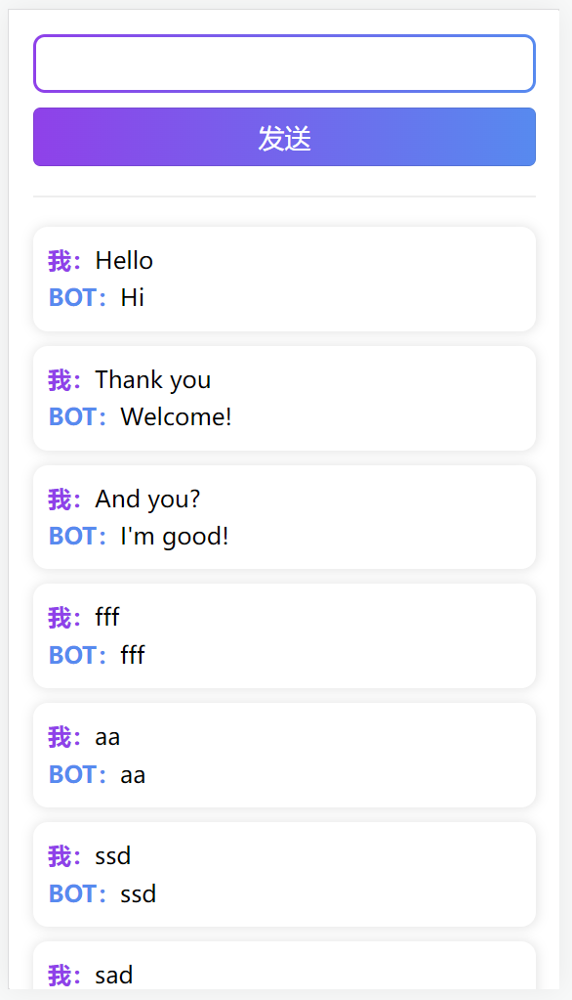
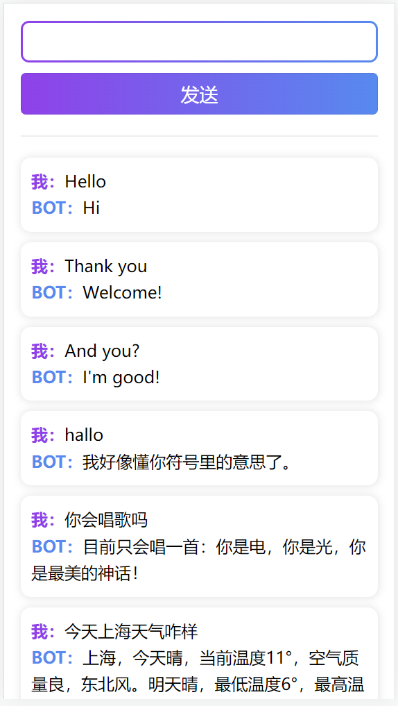
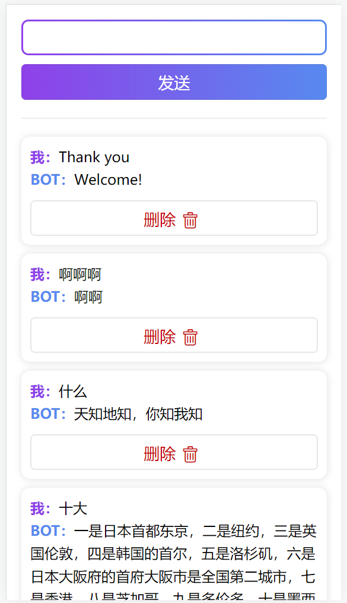
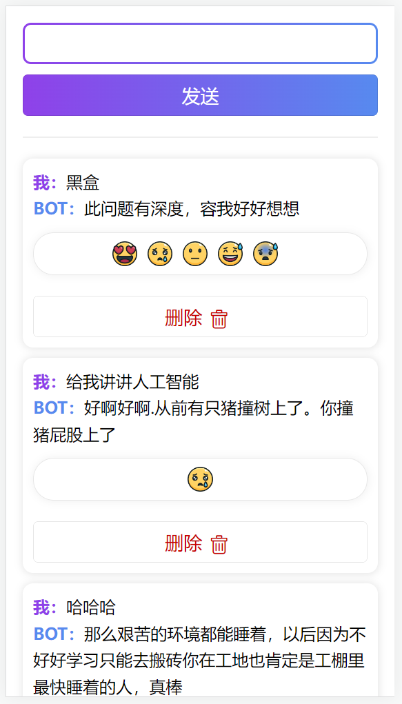
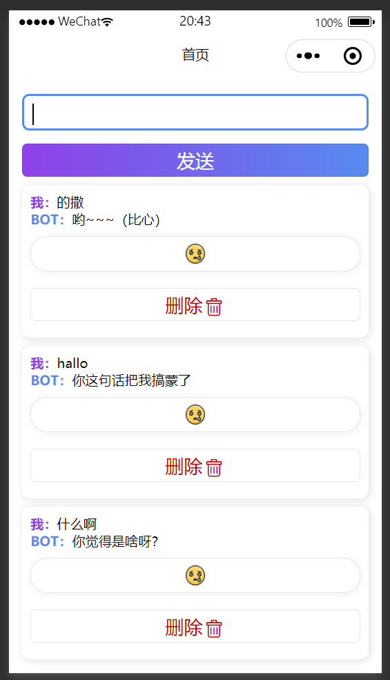

###

### <font color=skyblue>互动聊天</font>🤖 机器<font color=orange>人列表</font>

##### 姓名：宣正吉

---

#### 项目源码

项目在 GitHub 已经发布：
同时在 H5、小程序端也能运行，两个端的文件分别打包，其中还添加了 React Native 的 APK 文件，可直接安装在手机上使用：

---

#### 项目描述

这里将 TodoList 进行改造，同样具有一个输入框，输入的内容放入列表项当中，同时采用 Ajax 的方式和远程聊天机器人服务的 API 进行链接，返回对于输入内容的回复信息，同时还能够在列表项选择对应的表情，表达自己的心情。所修改的数据都会存到目前浏览器的缓存中。

---

#### 界面设计

采用圆角卡片式设计，白色背景，渐变色边框和阴影样式，输入框内容和列表项内容先预先设定一些：

<center>

</center>

#### 利用 Ajax 获取回复

通过 get 方法，发送问题并接收回复，Taro 中获取网络请求的方法是 Taro.request：

```js
// 发送函数
const onSend = () => {
  // 通过text获取请求
  Taro.request({
    url: "http://liulongbin.top:3006/api/robot", //仅为示例，并非真实的接口地址
    data: {
      spoken: text,
    },
    header: {
      "content-type": "application/json", // 默认值
    },
    success: function (res) {
      // console.log(res.data.data.info.text);
      if (text !== "") {
        let tmp = [...data, { t: text, r: res.data.data.info.text }];
        setData(tmp);
      }
      setText("");
    },
  });
};
```

<center>

</center>

#### 删除功能

为每个列表项添加一个删除按钮，用于删除所提问和回复的内容，通过渲染时的 index 传入删除函数，再利用 splice 方法删除数据中对应的数据，注意此时数据发生变化，界面中要更新数据：

```js
const onDelete = (index) => {
  let newList = [...data];
  newList.splice(index, 1);
  setData(newList);
};
```

<center>

</center>

#### 加入缓存

采用 Taro 的 setStorage 方法，在点击发送按钮时将数据存储到本地，可以将方法抽象为函数多次进行调用：

```js
// 新加载时载入数据
Taro.useLoad(() => {
  setData(Taro.getStorageSync("data") || {});
}, []);
// 发送函数
const onSend = async () => {
  // 通过text获取请求
  if (text != "") {
    const res = await Taro.request({
      url: "http://liulongbin.top:3006/api/robot", //仅为示例，并非真实的接口地址
      data: {
        spoken: text,
      },
      header: {
        "content-type": "application/json", // 默认值
      },
    });
    let tmp = [...data, { t: text, r: res.data.data.info.text }];
    setData(tmp);
    setText("");

    Taro.setStorageSync("data", tmp);
  }
};

const onDelete = (index) => {
  let newList = [...data];
  newList.splice(index, 1);
  setData(newList);
  Taro.setStorageSync("data", newList);
};
```

<font color=red>一个问题：为什么`Taro.setStorageSync("data", newList);`这句话中用 newList，即新产生的数据就可以存储，但是写成 state 就会延迟一步存储，即使这句话写在 setstate 后面也会有同样的问题？</font>

#### 表情选择

添加一个表情选择列表，从里面选择自己的反应，但是机器人的反应比较复杂，此功能还有待商榷：

```js
import { View, Text, Image } from "@tarojs/components";
import "../../../font/iconfont.css";
import { useState } from "react";
import Taro from "@tarojs/taro";

export default function EmojiSelecotr(props) {
  const emojis = [
    "https://cdn-icons-png.flaticon.com/128/1791/1791391.png",
    "https://cdn-icons-png.flaticon.com/128/1791/1791429.png",
    "https://cdn-icons-png.flaticon.com/128/1791/1791385.png",
    "https://cdn-icons-png.flaticon.com/128/1791/1791368.png",
    "https://cdn-icons-png.flaticon.com/128/1791/1791451.png",
  ];
  const [on, Seton] = useState(false);

  const handleEmoji = (index) => {
    // console.log(props.data);
    let newData = [...props.data];
    newData[props.ind].emo = index;
    props.setData(newData);
    Taro.setStorageSync("data", newData);
    Seton(false);
  };

  if (on) {
    return (
      <View className="selector">
        {/* <Image
          style="width:1.2rem;height:1.2rem;background: #fff;margin-right:0.5rem;"
          src={emojis[0]}
        /> */}
        {emojis.map((item, index) => (
          <Image
            style="width:1.2rem;height:1.2rem;background: #fff;margin-right:0.5rem;"
            src={emojis[index]}
            key={index}
            onClick={() => {
              handleEmoji(index);
            }}
          />
        ))}
      </View>
    );
  } else {
    return (
      <View className="selector">
        <Image
          style="width:1.2rem;height:1.2rem;background: #fff;"
          src={emojis[props.emo]}
          onClick={() => Seton(true)}
        />
      </View>
    );
  }
}
```

<center>

</center>

#### 微信小程序端

构建微信小程序端应用，界面如下，发现渐变边框不见了：

<center>

</center>

小程序已经发布，名称：宣宣的换皮贺卡，因为和之前的作业用的是同一个 ID，一个邮箱只能有一个 ID😅
